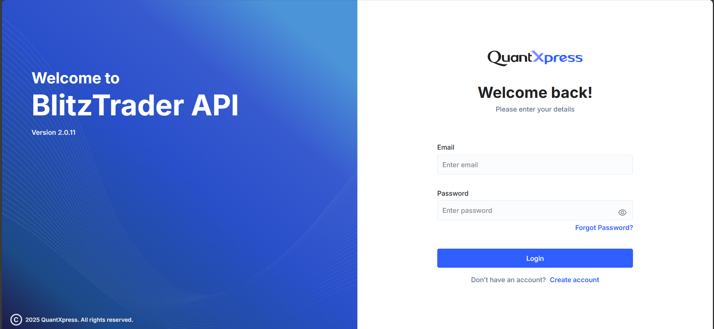

#  Welcome to BlitzTrader API

Welcome to **BlitzTrader API v2.0.11** — your gateway to building powerful trading applications with **QuantXpress**.
The BlitzTrader API Developer Portal is your gateway to securely integrating your application with the BlitzTrader ecosystem. It allows you to generate and manage API keys, access API documentation, and test your integration in a secure environment. It's an essential tool for developers who want to create apps that interact with BlitzTrader's powerful trading and market data API.

This quickstart guide will walk you through:

-  Logging into the developer portal  
-  Where to create your account  
-  Generating your API key  
-  Authenticating your API requests

---

##  Login Page

When you access the [BlitzTrader Portal](#), you'll see a login screen like this:

### Fields on the Login Screen

- **Email** – Enter the email address you used while registering.
- **Password** – Your login password.

You will also see:

- **Forgot Password?** – Use this if you've forgotten your credentials.
- **Create Account** – New to BlitzTrader? Click here to register.
---

!!! tip "Can't Login?"
    Ensure your email is correct and password is case-sensitive.
    If you're stuck, try the Forgot Password link to reset your password.

---

##  Don’t Have an Account?

If you're a new user, click on **Create Account** at the bottom of the login screen.  
You’ll be guided to the [Account Creation page](./1.create-account.md) where you can sign up with:

- Your full name and contact details  
- A secure password  
- Acceptance of our terms and conditions

!!! info "What Happens Next?"
    After creating your account, you'll be able to log in and generate your API key for using BlitzTrader programmatically.

---

