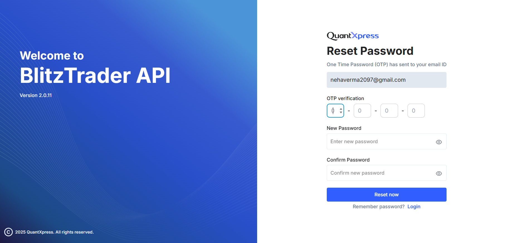
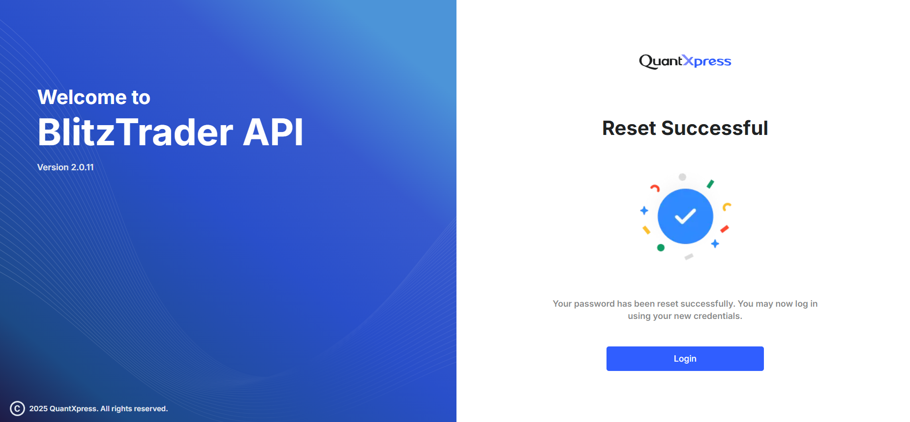

# Forgot Your Password? Here’s How to Reset It

If you’ve forgotten your password, the BlitzTrader API portal offers a secure reset flow.

---

## Step-by-Step Process

1. **Forgot Password** – Submit registered email.  
2. **OTP + New Password** – Enter OTP and set new password.  
3. **Reset Successful** – Confirmation and login.

---

## Forgot Password

Click **"Forgot Password?"** on the login screen.

### What to Do
- Enter **Email Address / User ID**  
- Click **Send Reset Link**  

Receive a **4-digit OTP** via email.

---

## Enter OTP & New Password

Redirected to **Reset Password** screen:

### Fields Required
- **OTP** – 4-digit One-Time Password  
- **New Password** / **Confirm Password**  

!!! tip "Password Guidelines"
    - Minimum 8 characters
    - At least one uppercase & lowercase letter
    - Include numbers and symbols
    - Avoid personal info or reused passwords

Click **Reset Now**.

---

## Reset Successful

Password updated successfully. Click **Login** to return to login screen.

---

## Notes & Tips

!!! note
    - Ensure your email is accessible before reset.
    - OTPs are valid for a short time.
    - If you didn’t request a reset, contact support.
