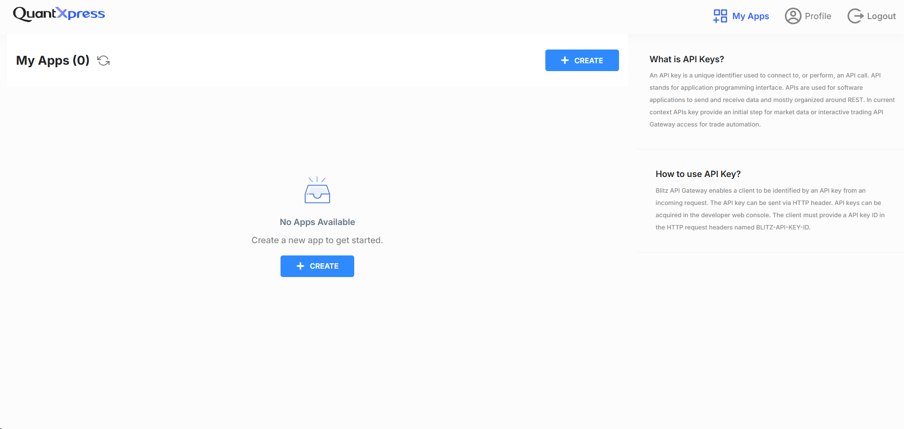

# Welcome to BlitzTrader API Dashboard

After logging in, you'll be directed to your **My Apps** dashboard, where you can manage your applications and API keys.

---

## My Apps

### No Apps Available

If you see **"No Apps Available"**, it means you haven't created any applications yet.

!!! tip "Getting Started"
    To start using the dashboard:
    - Click **Create New App** to register your first application.
    - Once created, you can generate API keys for that app.
    - Manage or delete keys as needed.
