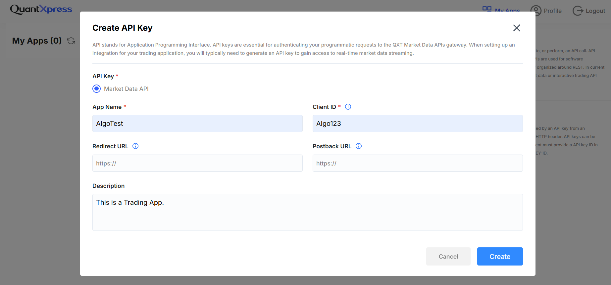
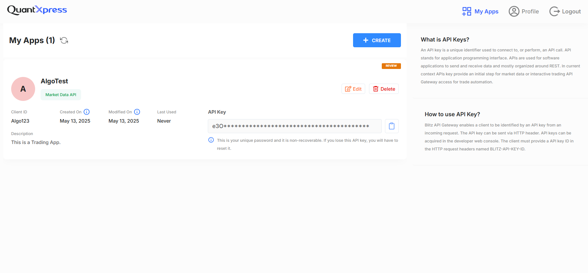

# Generating an API Key

Once you've logged into the **BlitzTrader Portal**, the next step is to generate an API key. This key is essential for authenticating an application and interacting with the BlitzTrader API.

This guide will walk you through:

- Navigating to the API key generation page  
- Creating and viewing an API key  
- Managing API keys  

---

## API Key Generation Page

After logging in, navigate to the **API Management** section. You'll find an option to **Create New API Key**.

Here’s a screenshot of the **API Key Management Interface**:

### Fields Discriptions

- **App Name** – Enter a name for the app you're integrating.  
- **Client ID** – Provide a unique client identifier.  
- **Redirect URL** – (Optional) Required for apps using redirects.  
- **Postback URL** – (Optional) Specify for apps needing postback notifications.  
- **Description** – Brief description of what the app does.

## Creating an API Key

1. Navigate to **My Apps** in your account dashboard.  
2. Click **Create** to generate a new API key.  
3. Fill in the required fields as described above.  
4. Click **Create API Key**.  
5. The new API key will be displayed. **Copy and store it securely** — you won’t be able to view it again.

### Generated API Key

!!! warning "Security Warning"
    Keep your API key secure. Never expose it in public repositories or client-side code.

---

## Managing an API Key

You can view, edit, or delete API keys anytime through the **API Management** page:

- **Edit** – Modify settings like app name or description.  
- **Delete** – Remove an API key when it is no longer needed.

---

## Important Notes

- **Security**: Treat your API key like a password.  
- **Limited Access**: Generate different keys for different apps or environments (development, production).  
- **API Key Permissions**: Assign appropriate permissions based on your use case.
